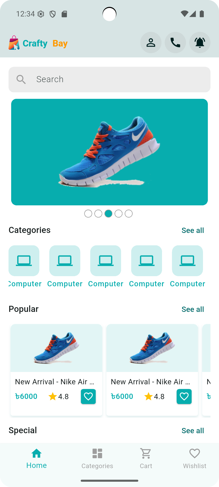
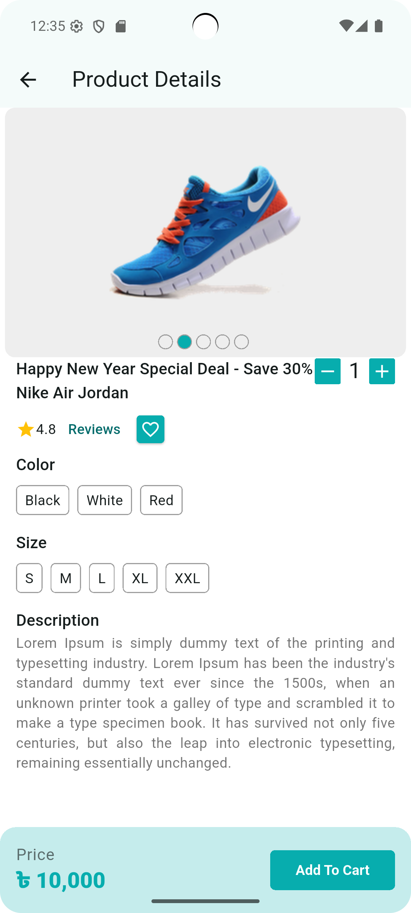
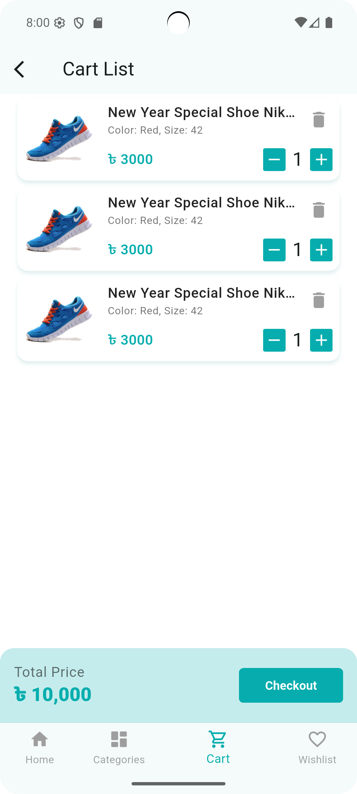
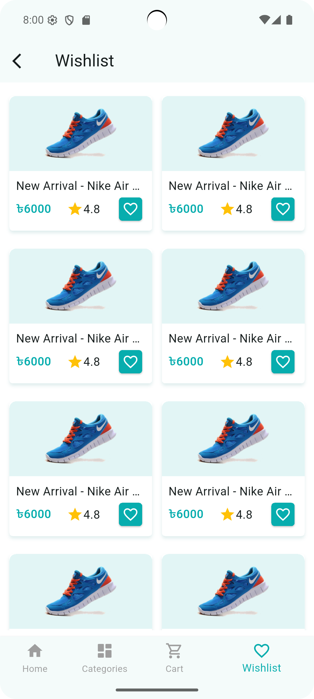

# 🛒 CraftyBay

CraftyBay is a cross-platform **e-commerce mobile application** built with **Flutter**, focused on clean UI, scalable architecture, and real-world shopping workflows.

This project demonstrates practical Flutter development skills including state management, REST API integration, Firebase usage, and a feature-based architecture suitable for production-level applications.

---

## ✨ Features

- Product category listing
- Product details with dynamic data
- Add to cart and cart management
- User authentication
- Responsive and reusable UI components
- Centralized network handling
- Clean and maintainable codebase

---

## 📸 Screenshots

<p align="center">
  
  
  
  
</p>

> Screenshots represent core user flows. More screens will be added as development progresses.

---

## 🛠 Tech Stack

- **Framework:** Flutter
- **Language:** Dart
- **State Management:** Provider
- **Backend / APIs:** RESTful APIs
- **Authentication:** Firebase Authentication
- **Database:** Cloud Firestore
- **Local Storage:** SharedPreferences
- **Networking:** Custom NetworkCaller service
- **Version Control:** Git & GitHub

---

## 📂 Project Structure

```text
lib/
├── firebase_options.dart
├── main.dart
│
├── app/
│   ├── app.dart
│   ├── app_colors.dart
│   ├── app_routes.dart
│   ├── app_theme.dart
│   ├── asset_paths.dart
│   ├── constants.dart
│   ├── urls.dart
│   ├── set_up_network_caller.dart
│   ├── extensions/
│   └── providers/
│
├── core/
│   └── services/
│       └── network_caller.dart
│
├── features/
│   ├── category/
│   │   ├── data/
│   │   │   └── models/
│   │   │       └── category_model.dart
│   │   └── presentation/
│   │       └── providers/
│   │           └── category_list_provider.dart
│   │
│   ├── auth/
│   │   ├── data/
│   │   │   └── models/
│   │   └── presentation/
│   │       ├── screens/
│   │       └── providers/
│   │
│   └── ... (other feature modules)
│
└── l10n/
